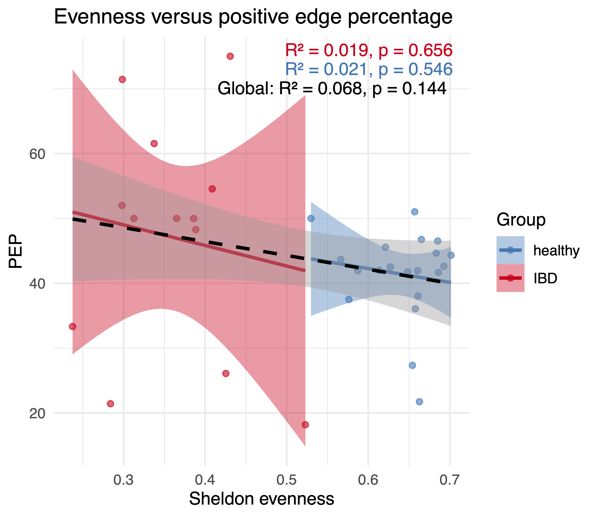
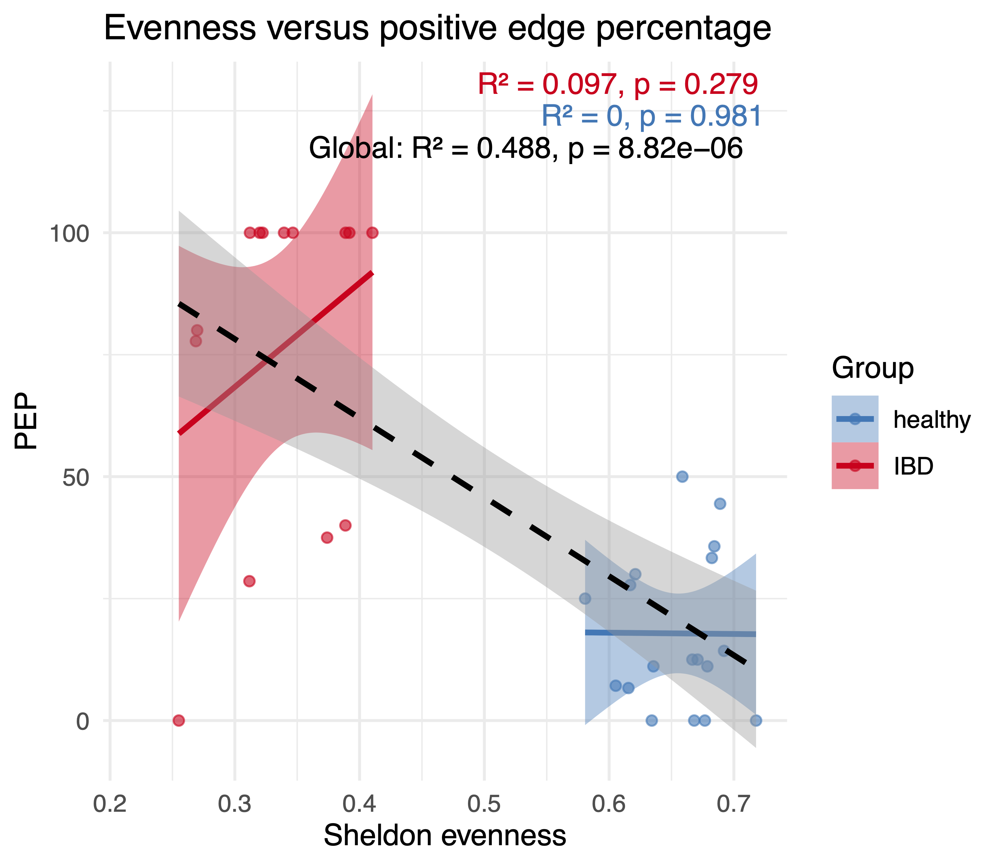
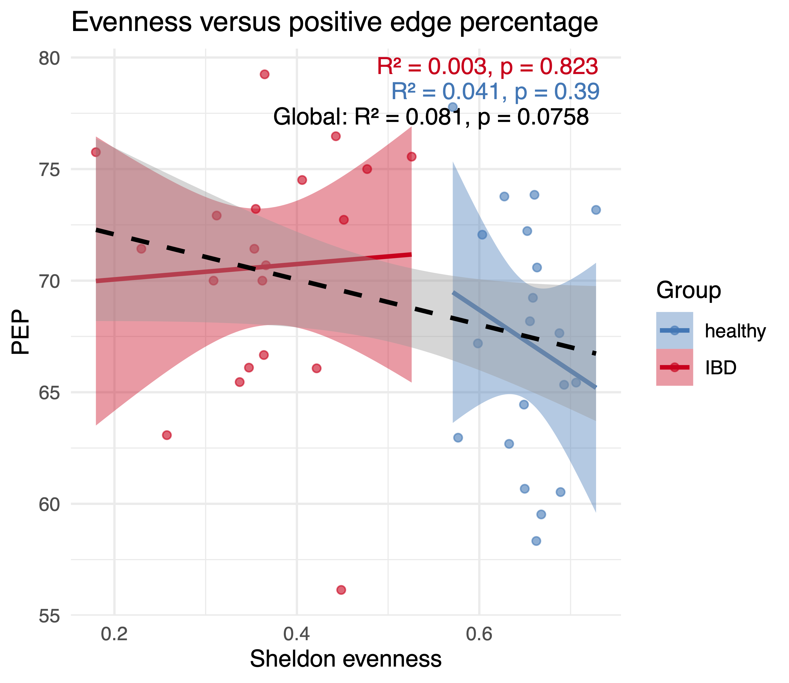

# README
## Summary
This repository shows that higher positive edge percentage (PEP) in inferred dysbiotic microbiome networks can arise from differential microbial responses to environmental change, without altering the underlying interaction network. Healthy and dysbiotic communities are simulated with the same generalized Lotka-Volterra interaction matrix; only species growth rates are changed. Thus, higher inferred PEP is not, by itself, evidence for stronger positive microbial interactions or increased cross-feeding.
## Implementation
Environmental impact is implemented by changing the growth rate in a standard generalized Lotka-Volterra (gLV) equation. For this, a global interaction matrix is defined for both healthy and dysbiotic communities. The global species pool is randomly sub-sampled to assemble local communities. A proportion of the species is initially designated to be 'bloomers'. In each dysbiotic sample, a random subset of the bloomers is 'boosted', i.e., their growth rate is multiplied by a factor larger than one, and the growth rates of all non-bloomers are diminished. This mimics the effects of environmental changes in an inflamed gut environment, in particular, an increase in oxygen levels. For each sub-community, a gLV simulation is carried out, and steady-state abundances are collected to generate a sample. Sub-communities are assembled and simulated as often as needed to reach the requested sample number. This results in two abundance matrices, one for the healthy community and one for the dysbiotic community. In the next step, abundances resulting from gLV simulations are converted into counts by multiplying by a constant factor, and matrices are then rarefied to the same total count number across samples. Evenness and beta diversity are then quantified, and network inference is carried out. Different inference algorithms are supported, including [BEEM-Static](https://github.com/CSB5/BEEM-static), [LIMITS](https://journals.plos.org/plosone/article?id=10.1371/journal.pone.0102451), [SpiecEasi](https://github.com/zdk123/SpiecEasi), and [CoNet](http://msysbiology.com/conet/). The whole procedure can be repeated with a different global interaction matrix.
## Motivation 
This script provides a counter-example to the claim made in [Lòpez et al. Science 2026](https://pubmed.ncbi.nlm.nih.gov/41747050/), which states that abundant taxa in dysbiotic communities form strong positive (cross-feeding) interactions and consequently increase PEP in inferred networks of dysbiotic communities compared to healthy ones. In this script, PEP is increased through environmental impact (change of growth rates) alone, since both healthy and dysbiotic communities are generated with the same interaction matrix. Of note, inferred PEP is systematically higher than the real PEP of the predefined interaction matrix, attesting to the low accuracy of network inference that was noted previously, e.g., in [Weiss et al. ISME 2016](https://www.nature.com/articles/ismej2015235]).
## Simulation results
The plots below show positive edge percentages (PEP) of networks inferred from synthetic healthy and dysbiotic community abundances versus their evenness. For this, in each simulation round, a healthy and a dysbiotic abundance matrix with 50 samples each was generated with the same underlying global interaction matrix. 20 simulation rounds with different global interaction matrices were carried out. The mean Sheldon evenness is reported for each abundance matrix.     
The networks were inferred using different inference algorithms.  
<b>BEEM</b>

<b>SpiecEasi</b>

<b>LIMITS</b>

Details on the settings and additional plots can be found in the simDysbiosis R file and simulations folder.

